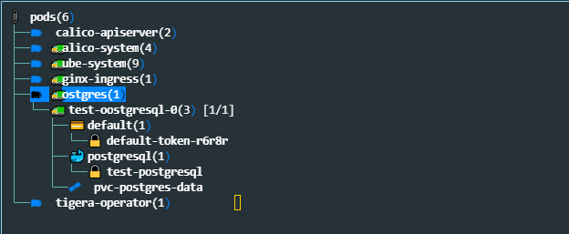

//Definición del tipo de documento
:doctype: book
:hardbreaks:
:experimental:
//Definición del template a utilizar
:Ruta_Base: ..\
:pdf-stylesdir: {Ruta_Base}templates\Ricoh\howto
:pdf-style: template.yml
:imagesdir: .\
//Información general del documento
:document_name: K9SCli
:version-label: Ver.
:revnumber: 1.0
:revdate: {localdate}
:Titulo: Utilidad K9S
:Subtitulo: 
:author: Ricoh Sistemas
:Subject: {Subtitulo}
:Keywords: Jenkins
:email: ignacio.yllana@ricoh.es
:PDFFileName: K9SCli{revnumber}.pdf
//Definición del TOC
:showtitle:
:toc:
:toc-title: Índice de contenidos
:toclevels: 6
:sectnums:
:sectnumlevels: 6
:chapter-label:
//Caracteres/iconos especiales
:checkedbox: pass:normal[&#9745;]
:uncheckedbox: pass:normal[&#9744;]
:SingleLeftArrow: pass:normal[&#8592;]
:SingleRightArrow: pass:normal[&#8594;]
:DoubleLeftArrow: pass:normal[&#8656;]
:DoubleRightArrow: pass:normal[&#8658;]
:WhiteSpace: pass:normal[&nbsp;]
//Parámetros específicos del documento

= {Titulo} : {Subtitulo}

== Objetivo

Instalación y configuración del software K9SCli el cual permite la administración de varios cluster de kubernetes desde un punto centralizado.

== Documentación de referencia
* https://k9scli.io/
* https://github.com/derailed/k9s
* https://k9scli.io/topics/skins/

== Instalación 

.Creamos el usuario
....
useradd -m -d /home/k9suser k9suser
....

.Creamos una carpeta para descargar los fuentes
....
mkdir source
cd source
git clone https://github.com/derailed/k9s.git .
....

.Se instalan las Herramientas de Desarrollo
....
yum -y groupinstall "Development Tools"
yum -y install go
....

.Instalamos
....
sudo install ./k9s /usr/bin
....

.Instalar el metric server en el entorno de Kubernetes para que se pueda mostrar estadísticas de CPU y Memoria::
....
kubectl apply -f  https://github.com/kubernetes-sigs/metrics-server/releases/latest/download/components.yaml -O metrics-server-components.yaml
kubectl patch deployment metrics-server -n kube-system --type 'json' -p '[{"op": "add", "path": "/spec/template/spec/containers/0/args/-", "value": "--kubelet-insecure-tls"}]'

....

== Manejo de la herramienta

.Desde una usuario que tenga instalado kubectl y el fichero de kubernetes config en su perfil, ejecutar

....
k9s
....

Una que se haya accedido al interface gráfico de la herramienta existen un conjunto de opciones para la gestión de componentes para lo cual se debe iniciar una linea de comandos con el simbolo ":" y a continuación la opción correspondiente que se puede autocompletar con el tabulador ejemplos:

* pods
* deploys
* services

Adicionalmente por cada uno de los elementos a gestionar existen un conjunto de acciones que son ejecutadas con la letra correspondiente

Además se pueden utiliza un conjunto de utilidades adicionales como son:

* xray (componente): Muestra en forma de arbol los componentes asociados y dependencias. Por ejemplo "xray pods"

* pulses: Un pequeño dashborad con el estado del cluster

